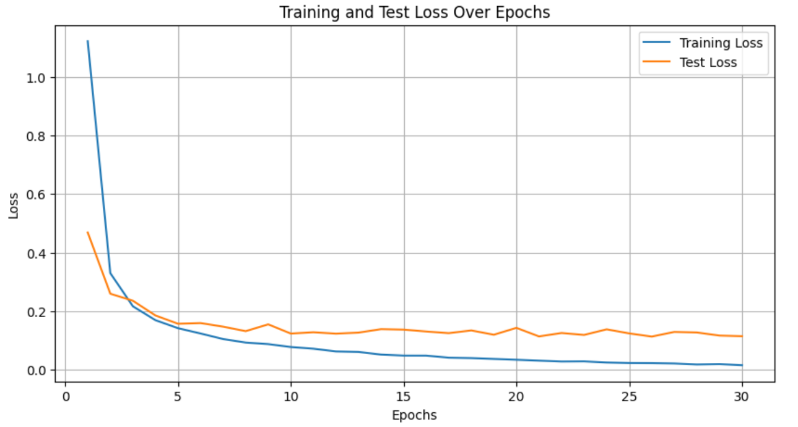
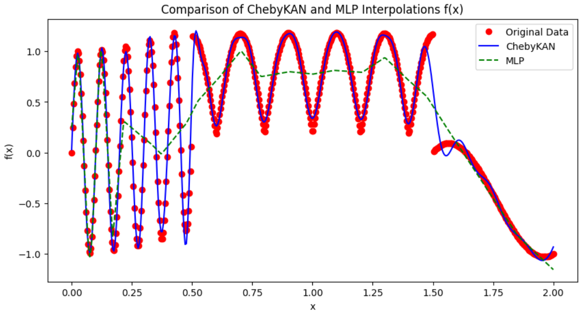

# ChebyKAN
Kolmogorov-Arnold Networks (KAN) using Chebyshev polynomials instead of B-splines.

This is inspired by Kolmogorov-Arnold Networks <https://arxiv.org/abs/2404.19756v2>, which uses B-splines to approximate functions. B-splines are poor in performance and not very intuitive to use. I'm trying to replace B-splines with Chebyshev polynomials.

[Chebyshev polynomials](https://en.wikipedia.org/wiki/Chebyshev_polynomials) are orthogonal polynomials defined on the interval [-1, 1]. They are very good at approximating functions and can be calculated recursively. 

A simple (and naive) implementation of ChebyKANLayer is provided in `chebyKANLayer.py`. Its not optimized yet.

# Usage
Just copy `ChebyKANLayer.py` to your project and import it.
```python
from ChebyKANLayer import ChebyKANLayer
```

# Example
Construct a ChebyKAN for MNIST
```python
class MNISTChebyKAN(nn.Module):
    def __init__(self):
        super(MNISTChebyKAN, self).__init__()
        self.chebykan1 = ChebyKANLayer(28*28, 32, 4)
        self.ln1 = nn.LayerNorm(32) # To avoid gradient vanishing caused by tanh
        self.chebykan2 = ChebyKANLayer(32, 16, 4)
        self.ln2 = nn.LayerNorm(16)
        self.chebykan3 = ChebyKANLayer(16, 10, 4)

    def forward(self, x):
        x = x.view(-1, 28*28)  # Flatten the images
        x = self.chebykan1(x)
        x = self.ln1(x)
        x = self.chebykan2(x)
        x = self.ln2(x)
        x = self.chebykan3(x)
        return x
```
**Note:** Since Chebyshev polynomials are defined on the interval [-1, 1], we need to use tanh to keep the input in that range. We also use LayerNorm to avoid gradient vanishing caused by tanh. Removing LayerNorm will cause the network really hard to train.

Have a look at `Cheby-KAN_MNIST.ipynb`, `Function_Interpolation_Test.ipynb`, and `Multivar_Interpolation_Test.ipynb` for more examples.

# Experiment Results
**MNIST:** ~97% accuracy after about 20 epochs. 
```
Epoch 1, Train Loss: 1.1218, Test Loss: 0.4689, Test Acc: 0.91
Epoch 2, Train Loss: 0.3302, Test Loss: 0.2599, Test Acc: 0.93
Epoch 3, Train Loss: 0.2170, Test Loss: 0.2359, Test Acc: 0.94
Epoch 4, Train Loss: 0.1696, Test Loss: 0.1857, Test Acc: 0.95
Epoch 5, Train Loss: 0.1422, Test Loss: 0.1574, Test Acc: 0.96
Epoch 6, Train Loss: 0.1241, Test Loss: 0.1597, Test Acc: 0.95
Epoch 7, Train Loss: 0.1052, Test Loss: 0.1475, Test Acc: 0.96
Epoch 8, Train Loss: 0.0932, Test Loss: 0.1321, Test Acc: 0.96
Epoch 9, Train Loss: 0.0879, Test Loss: 0.1553, Test Acc: 0.95
Epoch 10, Train Loss: 0.0780, Test Loss: 0.1239, Test Acc: 0.96
Epoch 11, Train Loss: 0.0722, Test Loss: 0.1283, Test Acc: 0.96
Epoch 12, Train Loss: 0.0629, Test Loss: 0.1236, Test Acc: 0.96
Epoch 13, Train Loss: 0.0612, Test Loss: 0.1271, Test Acc: 0.96
Epoch 14, Train Loss: 0.0521, Test Loss: 0.1390, Test Acc: 0.96
Epoch 15, Train Loss: 0.0488, Test Loss: 0.1374, Test Acc: 0.96
Epoch 16, Train Loss: 0.0487, Test Loss: 0.1309, Test Acc: 0.96
Epoch 17, Train Loss: 0.0416, Test Loss: 0.1253, Test Acc: 0.96
Epoch 18, Train Loss: 0.0402, Test Loss: 0.1346, Test Acc: 0.96
Epoch 19, Train Loss: 0.0373, Test Loss: 0.1199, Test Acc: 0.97
Epoch 20, Train Loss: 0.0346, Test Loss: 0.1434, Test Acc: 0.96
Epoch 21, Train Loss: 0.0314, Test Loss: 0.1142, Test Acc: 0.97
Epoch 22, Train Loss: 0.0285, Test Loss: 0.1258, Test Acc: 0.97
Epoch 23, Train Loss: 0.0289, Test Loss: 0.1192, Test Acc: 0.97
```

The network parameters are [28*28, 32, 16, 10] with 4 degree Chebyshev polynomials.

It needs a low learning rate (2e-4) to train. The network is very sensitive to the learning rate.

---

**Function Interpolation:** much better than MLPs when the function is (mostly) smooth, very effective in discovering mathematical laws.



ChebyKAN: [1, 8, 1] with 8 degree.

MLP: [1, 1024, 512, 1] with ReLU

# Future Work
More experiments and optimizations are needed to prove the correctness and effectiveness of ChebyKAN. 
Not sure if the current parameters initialization is optimal. Maybe Xavier initialization is better.